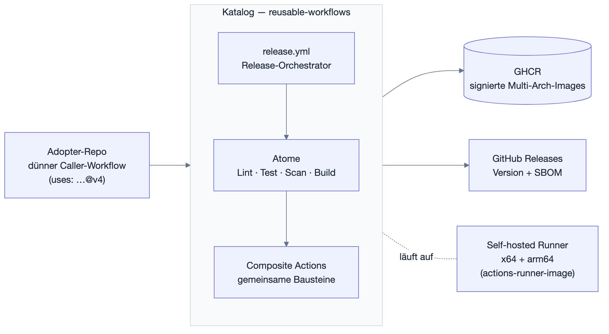
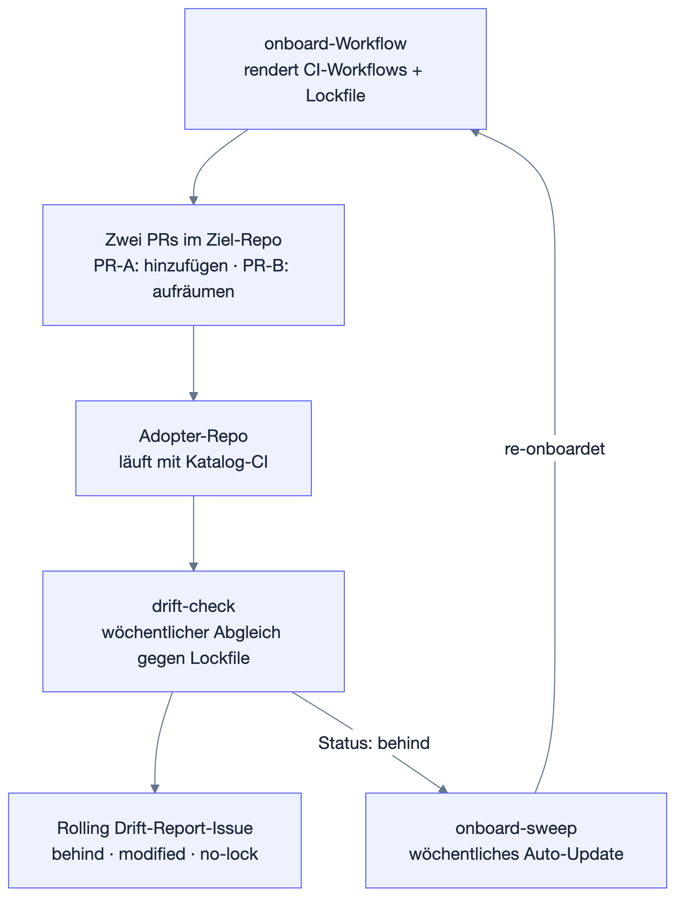

<p align="center">
  
</p>

# serverkraken/reusable-workflows

[](https://github.com/serverkraken/reusable-workflows/actions/workflows/validate.yml)
[](https://github.com/serverkraken/reusable-workflows/actions/workflows/catalog-release.yml)
[](https://github.com/serverkraken/reusable-workflows/actions/workflows/failure-paths-nightly.yml)


<!-- version-badges:start -->


| Component | Version | Tag |
|---|---|---|
| reusable-workflows | 4.24.0 | [v4.24.0](https://github.com/serverkraken/reusable-workflows/releases/tag/v4.24.0) |
<!-- version-badges:end -->

Versionierter, getesteter Katalog wiederverwendbarer GitHub-Actions-Workflows für die `serverkraken`-Organisation. Statt CI-Workflows zwischen Repos zu kopieren, referenziert jedes Repo den Katalog mit einer einzigen `uses:`-Zeile — und bekommt Updates über semantische Versionen.

## Überblick

Vor diesem Katalog pflegte jedes serverkraken-Repo (Go-Services, Python-Apps, Rust-Tools, Flutter-Apps, Helm-Charts, GitOps-Cluster) seine eigenen, nahezu identischen CI-Workflows. Jede Verbesserung — ein neuer Scanner, ein Signatur-Schritt, ein Bugfix im Multi-Arch-Build — musste in jedes Repo einzeln kopiert werden.

Dieser Katalog zieht die Duplikate in eine zentrale, versionierte Sammlung von `workflow_call`-Workflows zusammen. Adopter-Repos halten nur noch dünne Caller-Workflows:

```yaml
jobs:
  ci:
    uses: serverkraken/reusable-workflows/.github/workflows/trivy-fs.yml@v4
    secrets: inherit
```

Der Katalog ist in zwei Ebenen organisiert:

- **Atome** (`.github/workflows/*.yml`) — je ein aufrufbarer Workflow pro Aufgabe: Lint, Test, Security-Scan, Image-Build, Release. Adopter komponieren sie oder nutzen den fertigen Orchestrator `release.yml`.
- **Composite Actions** (`actions/*`) — gemeinsame Bausteine, die mehrere Atome teilen (Toolchain-Setup, Tool-Installation, Onboarding-Schritte).

Der Katalog testet sich selbst (Self-CI mit Fixtures, Integrationstests und nächtlichen Failure-Path-Tests) und released sich über die eigenen Atome — wenn das Release-Atom bricht, kann der Katalog selbst nicht mehr releasen ("Dogfooding").

## Features

- **Ein-Zeilen-Adoption:** Jede CI-Fähigkeit ist ein `uses:`-Aufruf; Onboarding neuer Repos ist komplett automatisiert (siehe unten).
- **End-to-End-Release-Pipeline:** release-please liest Conventional Commits, taggt `vX.Y.Z`, baut Multi-Arch-Images, signiert (Cosign keyless via OIDC), attestiert SLSA-Provenance, hängt ein SPDX-SBOM ans Release und scannt das publizierte Image mit Trivy.
- **Native Multi-Arch-Builds:** amd64 und arm64 werden auf nativen Self-hosted Runnern parallel gebaut (kein QEMU), per Digest gepusht und zu einer Manifest-Liste zusammengeführt.
- **Sprach-Atome mit Coverage-Gate:** Go, Python, Rust und Flutter je mit Lint- und Test-Atom; die Test-Atome erzwingen eine Mindest-Coverage (Default 80 %, pro Repo überschreibbar).
- **Security als Standard:** Trivy-Filesystem-Scan auf jedem PR, Trivy-Image-Scan bei jedem Release, gitleaks-Secret-Scan, kube-linter und kubeconform für Kubernetes-Manifeste — SARIF-Upload in den Code-Scanning-Tab inklusive.
- **Automatisches Flottenmanagement:** Wöchentlicher `drift-check` vergleicht jeden Adopter gegen sein Lockfile; `onboard-sweep` re-onboardet veraltete Adopter und onboardet neue Repos der Org automatisch.
- **Per-Adopter-Overrides:** `SK_*`-GitHub-Variables (z.B. `SK_COVERAGE_THRESHOLD`) erlauben Abweichungen vom Template-Default, ohne die gerenderten Workflows anzufassen.
- **Stabile Verträge:** Die `inputs`/`outputs`/`secrets`-Form jedes Atoms ist die öffentliche API; Änderungen daran sind Major-Bumps. Alle Schemata stehen in [`docs/contracts.md`](docs/contracts.md).

## Architektur

Adopter-Repos rufen den Katalog auf, der Katalog delegiert intern an seine Atome und Composite Actions — ausgeführt wird alles auf den Self-hosted Runnern der Org:



- **Adopter-Repo:** hält nur dünne Caller-Workflows (`ci.yml`, `release.yml`, `prerelease.yml`, `cleanup.yml`), gepinnt auf den aktuellen Katalog-Major `@v4`.
- **release.yml (Orchestrator):** die opinionated Komplett-Pipeline — release-please → Tag + Release → Multi-Arch-Build → Signatur/Attestation/SBOM → Trivy-Image-Scan. Die meisten Adopter brauchen nur diesen Einstiegspunkt.
- **Atome:** einzeln aufrufbare Workflows für Lint, Test, Scans und Builds — für Adopter mit Sonderwegen direkt komponierbar.
- **Composite Actions:** gemeinsame Bausteine wie Toolchain-Setup und Tool-Installation, intern von den Atomen genutzt.
- **Self-hosted Runner:** die Jobs laufen auf dem Runner-Pool der Org (x64 und arm64, Image aus [`actions-runner-image`](https://github.com/serverkraken/actions-runner-image)); über `runs_on`-Inputs kann jedes Atom auf `ubuntu-latest` umgelenkt werden.

## Onboarding und Flottenbetrieb

Neue Repos werden nicht von Hand verdrahtet: Der `onboard`-Workflow rendert die Caller-Workflows passend zum erkannten Repo-Profil (Go, Python, Rust, Flutter, Helm, GitOps oder Monorepo-Mix) und öffnet zwei PRs im Ziel-Repo. Danach hält die wöchentliche Automatik die Flotte aktuell:



- **onboard:** per `workflow_dispatch` aus dem Actions-Tab dieses Repos gestartet; erkennt das Profil des Ziel-Repos, rendert die Workflows und legt `.github/onboard.lock.json` mit den Hashes der gerenderten Dateien an. PR-A fügt hinzu, PR-B räumt abgelöste Legacy-Workflows ab.
- **drift-check:** wöchentlicher Abgleich jedes Adopters gegen sein Lockfile; das Ergebnis (`behind`, `modified`, `no-lock`) landet in einem einzigen rollierenden Drift-Report-Issue.
- **onboard-sweep:** re-onboardet Adopter mit Status `behind` automatisch gegen den aktuellen Katalog-Major und onboardet neue `serverkraken/*`-Repos (Opt-out per Repo-Topic `no-serverkraken-onboard`).

Repos, deren Layout die Erkennung nicht ableiten kann (Root-Modul + Image-Verzeichnisse, Charts neben Code, e2e-Suiten), deklarieren das in `.github/onboard.yml` — siehe [`docs/operations.md`](docs/operations.md) §11.

Details und Operator-Handgriffe: [`docs/operations.md`](docs/operations.md) §5–§7.

## Nutzung

### Schnellstart (Adopter)

Voraussetzung ist nur die org-weit installierte GitHub App `serverkraken-release-bot` — keine per-Repo-Secrets, `secrets: inherit` genügt.

1. Im Actions-Tab dieses Katalog-Repos den Workflow **onboard** wählen.
2. "Run workflow" mit `target_repos: owner/repo` (kommasepariert für mehrere) starten.
3. PR-A im Ziel-Repo mergen, einen `feat:`/`fix:`-Commit pushen — release-please öffnet einen Release-PR. Diesen mergen → Image-Build, Scan und Release laufen automatisch.

### Was gerendert wird

Vier Workflows landen in `.github/workflows/` des Ziel-Repos, gepinnt auf `@v4`. Die Skeleton-Quellen sind die kanonische Referenz:

- [`ci.yml.tmpl`](docs/adopter-templates/skeletons/ci.yml.tmpl) — Lint + Test + trivy-fs (pull_request)
- [`release.yml.tmpl`](docs/adopter-templates/skeletons/release.yml.tmpl) — release-please → Image-Build → trivy-image (push auf main)
- [`prerelease.yml.tmpl`](docs/adopter-templates/skeletons/prerelease.yml.tmpl) — manueller Feature-Branch-Image-Build (workflow_dispatch)
- [`cleanup.yml.tmpl`](docs/adopter-templates/skeletons/cleanup.yml.tmpl) — GHCR-Retention (wöchentlicher Cron)

Alle vier lesen `SK_*`-Repo-/Org-Variables für Overrides pro Adopter — die vollständige Liste steht in den gerenderten Dateien, die Input-Schemata in [`docs/contracts.md`](docs/contracts.md).

### Atome direkt komponieren (fortgeschritten)

Wenn das Onboarding nicht passt (Repo außerhalb der Org, Sonder-Pipeline), lassen sich die Atome direkt aufrufen:

```yaml
# Beispiel: nur der PR-Security-Scan
jobs:
  scan:
    uses: serverkraken/reusable-workflows/.github/workflows/trivy-fs.yml@v4
    secrets: inherit
```

| Atom                         | Zweck                                                          |
|------------------------------|----------------------------------------------------------------|
| `release.yml`                | Orchestrator: release-please → Build → Sign/Attest/SBOM → Scan |
| `semantic-release.yml`       | release-please + wandernde Major-/Minor-Tags                   |
| `docker-build.yml`           | Multi-Arch-Build + Cosign + Attestation + SBOM                 |
| `docker-build-multi.yml`     | Matrix über mehrere Dockerfiles pro Repo                       |
| `goreleaser.yml`             | goreleaser-Wrapper für CLI-Binary-Releases                     |
| `helm-publish.yml`           | helm lint + package + OCI-Push nach GHCR                       |
| `release-flutter-android.yml`| signiertes APK/AAB bauen und ans Release hängen                |
| `trivy-image.yml`            | Image-Scan (Vulns, Secrets, Misconfig)                         |
| `trivy-fs.yml`               | Filesystem-Scan (Vulns, Secrets, Misconfig)                    |
| `secret-scan.yml`            | gitleaks, git-history-aware                                    |
| `kube-lint.yml`              | kube-linter über Kubernetes-Manifeste                          |
| `kube-validate.yml`          | kustomize build + kubeconform-Schema-Validierung               |
| `e2e-kind.yml`               | Kubernetes-e2e mit kind (Consumer-Script, Diagnose-Artifact, Cleanup-Garantie) |
| `cleanup-images.yml`         | GHCR-Retention                                                 |
| `lint-go.yml` / `test-go.yml`           | go vet + golangci-lint / go test + Coverage-Gate    |
| `lint-python.yml` / `test-python.yml`   | ruff + mypy / pytest + Coverage-Gate (poetry/uv/pip automatisch erkannt) |
| `lint-rust.yml` / `test-rust.yml`       | cargo fmt + clippy / cargo test + cargo-llvm-cov    |
| `lint-flutter.yml` / `test-flutter.yml` | dart format + flutter analyze / flutter test + Coverage-Gate |
| `build-flutter-android.yml`  | PR-Gate: flutter build apk (debug, unsigniert) — kompiliert die Android-Seite |
| `lint-helm.yml`              | helm lint + ct lint                                            |
| `lint-shell.yml`             | shellcheck über getrackte Shell-Skripte, optional shfmt        |
| `tofu-validate.yml`          | tofu fmt + init + validate + tflint je Stack, credential-frei  |
| `tofu-plan.yml`              | tofu plan gegen das Backend, als Sticky-PR-Kommentar           |
| `tofu-apply.yml`             | wendet einen freigegebenen Plan an, dispatch-only              |
| `tofu-destroy.yml`           | räumt eine Umgebung ab, zweistufig und dispatch-only           |
| `tofu-unlock.yml`            | löst einen liegengebliebenen State-Lock, dispatch-only         |
| `tofu-drift.yml`             | geplanter Plan gegen die echte Infrastruktur, rollendes Issue  |

### Versionierung und Pinning

Der Katalog folgt [Semantic Versioning](https://semver.org/), getrieben von [release-please](https://github.com/googleapis/release-please) über Conventional Commits.

| Pin       | Workflow-Definition       | nachgeladene Actions/Skripte |
|-----------|---------------------------|------------------------------|
| `@v4`     | immer das neueste 4.x.y   | `v4`                         |
| `@v4.2`   | immer das neueste 4.2.x   | `v4`                         |
| `@v4.2.3` | unveränderlich            | `v4`                         |

**Ein Pin friert die Workflow-Datei ein, nicht alles, was sie ausführt.** 22 Atome
checken zur Laufzeit den Katalog aus, um Composite-Actions und Skripte unter
`actions/` und `scripts/` zu laden — und zwar am **schwebenden Major-Tag**, nicht
an der Version, mit der sie aufgerufen wurden. Ein Aufruf von `@v4.2.3` führt
also die Workflow-Datei aus 4.2.3 aus, lädt dabei aber die Skripte, auf die `v4`
gerade zeigt.

Das ist so gewollt: Adopter bekommen Sicherheitsfixes an den Skripten, ohne neu
pinnen zu müssen, und die Composite-Actions bleiben untereinander zu ihrem Major
kohärent. Wer eine wirklich unveränderliche Lieferkette braucht — jede
ausgeführte Zeile an eine Revision gebunden —, bekommt sie mit diesem Pin
**nicht**; das wäre eine eigene Entscheidung (technisch über
`github.job_workflow_sha` möglich) mit dem umgekehrten Nachteil, dass ein
gepinnter Adopter auch fehlerhafte Skripte behält, bis er selbst nachzieht.

**Breaking Changes** (jede Änderung an der Input-/Output-/Secret-Form eines Atoms) bumpen den Major. Details in [CONTRIBUTING.md](CONTRIBUTING.md).

## Composite Actions

Gemeinsame Bausteine unter `actions/`, intern von den Atomen genutzt und für fortgeschrittene Consumer verfügbar:

| Action                            | Zweck                                                        |
|-----------------------------------|--------------------------------------------------------------|
| `actions/install-trivy`           | Trivy-CLI gepinnt installieren (direktes Binary, bewusst ohne trivy-action) |
| `actions/install-gitleaks`        | gitleaks-CLI gepinnt installieren                            |
| `actions/install-kube-linter`     | kube-linter-CLI gepinnt installieren                         |
| `actions/install-shellcheck`      | shellcheck-CLI gepinnt installieren (+ optional shfmt)       |
| `actions/setup-kube-toolchain`    | kustomize + kubeconform (+ optional sops/age) bereitstellen  |
| `actions/setup-kind-toolchain`    | kind + kubectl + cilium-cli mit Presence-Check installieren, Fallback in job-privates Verzeichnis |
| `actions/setup-flutter-toolchain` | Java + Android-SDK + Flutter + pub get + build_runner        |
| `actions/setup-python-deps`       | Paketmanager erkennen (poetry/uv/pip) + Dependencies installieren |
| `actions/setup-tofu-toolchain`    | OpenTofu (+ optional tflint) gepinnt installieren            |
| `actions/setup-sk-workflows`      | die Go-Onboarding-CLI aus Release-Assets oder Source installieren |
| `actions/ghcr-login`              | GHCR-Login-Wrapper                                           |
| `actions/compute-prerelease-tag`  | OCI-gültigen Tag aus Branch + Kurz-SHA berechnen             |
| `actions/post-prerelease-comment` | idempotenter PR-Kommentar mit `docker pull`-Kommando         |
| `actions/onboard-detect`          | Repo-Profil erkennen (Sprachen, Dockerfiles, GitOps, Monorepo) |
| `actions/onboard-render`          | Adopter-Workflows aus den Skeletons rendern                  |
| `actions/onboard-drift`           | Drift-Status eines Adopters gegen sein Lockfile berechnen    |
| `actions/onboard-apply-defaults`  | Repo-Settings-Defaults (Branch-Protection, Topics) anwenden  |

## Die `sk-workflows`-CLI

Die Onboarding-Logik (Profil-Erkennung, Rendering, Drift, Repo-Defaults) steckt in einer Go-CLI unter `cmd/sk-workflows` — die Workflows rufen sie auf, lokal lässt sie sich zum Vorschau-Rendern nutzen:

```bash
go build -o bin/sk-workflows ./cmd/sk-workflows
bin/sk-workflows preview \
  --repo-path ../ziel-repo \
  --out /tmp/sk-workflows-preview \
  --pin v4
```

Das schreibt `profile.json`, die gerenderten Workflow-Dateien und `.github/onboard.lock.json` in das Ausgabeverzeichnis — dieselben Artefakte, die der `onboard`-Workflow produzieren würde.

## Entwicklung

Statische Validierung und Tests, wie sie auch die Self-CI ausführt:

```bash
# Workflows linten
docker run --rm -v "$PWD:/repo" -w /repo rhysd/actionlint:latest

# YAML-Hygiene
pipx run yamllint .github/ actions/ tests/

# Shell-Logik (bats-Unit-Tests)
bats tests/shell/

# Go-CLI
go test ./...

# Integrationstests lokal (eingeschränkt — kein OIDC/GHCR/self-hosted)
act pull_request -W .github/workflows/integration.yml --container-architecture linux/amd64
```

Die Self-CI besteht aus vier Schichten: `validate` (actionlint + yamllint + Konventions-Gates), `self-ci` (jedes Inspektions-Atom gegen Fixtures), `integration` (Build-/Release-Atome end-to-end) und `failure-paths-nightly` (die designten Rot-Fälle, nächtlich, damit der PR-Check grün bleibt). Commits folgen [Conventional Commits](https://www.conventionalcommits.org/); alle Actions sind auf SHA-Digests gepinnt (Renovate pflegt die Pins). Details in [CONTRIBUTING.md](CONTRIBUTING.md).

## Abhängigkeiten zu anderen Repos

- [serverkraken/actions-runner-image](https://github.com/serverkraken/actions-runner-image) — das Container-Image des Self-hosted-Runner-Pools, auf dem die Katalog-Jobs laufen; sein Bake-Set (vorinstallierte Tools) wird aus den Toolcache-Misses dieser Workflows gesteuert.
- [serverkraken/renovate-config](https://github.com/serverkraken/renovate-config) — das geteilte Renovate-Preset der Org, das `.github/renovate.json5` hier per `extends` einbindet.

## Lizenz

[MIT](LICENSE).
